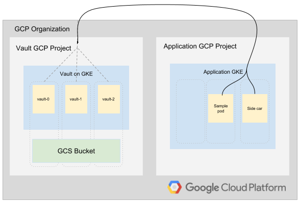

# Vault on GKE

## Table of Contents

* [Introduction](#introduction)
* [Architecture](#architecture)
* [Inital Setup](#initial-setup)
  * [Configure gcloud](#configure-gcloud)
  * [Get the code](#get-the-code)
* [Tools](#tools)
  * [Install Cloud SDK](#install-cloud-sdk)
  * [Install Kubectl](#install-kubectl)
  * [Install Terraform](#install-terraform)
  * [Install Vault CLI](#install-vault-cli)
  * [Configure Authentication](#configure-authentication)
* [Deployment](#deployment)
  * [Create the clusters](#create-the-clusters)
  * [Configure Static Key-Value Secrets in Vault](#configure-static-key-value-secrets-in-vault)
  * [Configure Kubernetes Pod Authentication to Vault](#configure-kubernetes-pod-authentication-to-vault)
  * [Manually Retrieve Secrets from a Pod](#manually-retrieve-secrets-from-a-pod)
  * [Configure an Auto-Init Example Application](#configure-an-auto-init-example-application)
  * [Configure Dynamic GCP Service Account Credentials](#configure-dynamic-gcp-service-account-credentials)
* [Validation](#validation)
* [Teardown](#teardown)
* [Troubleshooting](#troubleshooting)
* [Relevant Material](#relevant-material)

## Introduction

[Hashicorp Vault][1] secures, stores, and tightly controls access to tokens, passwords, certificates, API keys, and other secrets.  In addition, Vault offers unique capabilities for centrally managing secrets used by application pods inside a [Google Kubernetes Engine][6] cluster.  For example, Vault supports authenticating application pods via the Kubernetes Service Account, audit logging of clients accessing/using secrets, automatic credential expiration, credential rotation, and more.

Many new users to Kubernetes leverage the built-in secrets object to store sensitive data used by their application pods.  However, storing secret data in YAML files checked into source control is not a recommended approach for several security reasons.  The secret data is statically defined, difficult to change, difficult to control access to, and difficult to keep off developer filesystems and CI/CD systems.  As a best practice, secrets should not kept alongside the application in the same YAML manifests.  They should be stored in a central secrets management system such as Vault and fetched at runtime only by the application or process that needs them.  Should those secrets ever become compromised, the process of revoking, auditing, and rotating the secrets is simple since they are centrally controlled and managed with Vault.

Building and running a highly-available Vault cluster on a dedicated GKE cluster is outside the scope of this demo, so this codebase leverages [Seth Vargo's Vault-on-GKE][2] repository as a [Terraform][5] module. Seth's repository stands up a separate, highly-availabile GKE cluster running the Vault cluster components with Google Cloud Storage for a highly durable secrets storage backend.

This demo deploys two private Kubernetes Engine Clusters into separate GCP projects. One cluster is dedicated to running [Vault][1] and is built using [Seth Vargo's Vault-on-GKE][2] [Terraform][5] repository.  The second cluster holds the applications that will fetch and use secrets from the Vault cluster.  The walkthrough covers creating and storing secrets in Vault, using Kubernetes authentication from within a pod to login to Vault, and fetching short-lived Google Service Account credentials on-demand from Vault within a pod.  These examples demonstrate the most common usage patterns of Vault from pods within another Kubernetes cluster.

## Architecture

The demonstration code will deploy a dedicated project (pictured left) to house the Vault cluster in its own GKE Cluster and expose the TLS-protected Vault endpoint URL behind a Regional Load Balancer.  It will also create a separate GKE Cluster (pictured right) to hold the sample applications that will interact with the Vault endpoint to retrieve secrets in several ways.



Important Notes:

**This demo codebase is NOT production-ready in the default state.**

* The Vault URL is exposed via a public load balancer which is not typically suitable for production environments.  Refer to: [Vault on GKE][2] for more information on production hardening this Vault cluster.

* The GKE Clusters are configured as private clusters which removes the public IP from GKE worker nodes.  However, the Terraform `master_authorized_networks_config` setting is configured by default with the cidr block of `0.0.0.0/0` which allows any IP to reach the GKE API Servers.  Production configurations should set specific IPs/subnets to restrict access to the API servers from only approved source locations.  To implement this hardening measure, modify the `kubernetes_master_authorized_networks` list variable in `scripts/generate-tfvars.sh` before proceeding.  Be sure that the subnets include the IP address your workstation is originating from or the provisioning steps will fail.

## Initial Setup

The steps described in this document require the installation of several tools and the proper configuration of authentication to allow them to access your GCP resources.

### Configure gcloud

When using cloud shell execute the following command to setup gcloud cli

```console
gcloud init
```

### Get The Code

* [Fork the repo](https://help.github.com/articles/fork-a-repo/)
* [Clone your fork](https://help.github.com/articles/cloning-a-repository/)

## Tools

### Install Cloud SDK

If you are not running on Google Cloud Shell, you will need to install the Google Cloud SDK.  The Google Cloud SDK is used to interact with your GCP resources. [Installation instructions](https://cloud.google.com/sdk/downloads) for multiple platforms are available online.

### Install Kubectl

If you are not running on Google Cloud Shell, you will need to install kubectl. The kubectl CLI is used to interteract with both Kubernetes Engine and kubernetes in general.
[Installation instructions](https://kubernetes.io/docs/tasks/tools/install-kubectl/)
for multiple platforms are available online.

### Install Terraform

Terraform is used to automate the manipulation of cloud infrastructure. Its [installation instructions](https://www.terraform.io/intro/getting-started/install.html) are also available online.

### Install Vault CLI

The Vault CLI binary is used to connect to the Vault cluster to set configuration and retrieve secrets. Follow the [installation instructions](https://learn.hashicorp.com/vault/getting-started/install) to install the binary for your platform.

### Configure Authentication

The Terraform configuration will execute against your GCP environment and create a Kubernetes Engine cluster running a simple application. The configuration will use your personal account to build out these resources. To setup the default account the configuration will use, run the following command to select the appropriate account:

```console
gcloud auth application-default login
```

## Deployment

### Create the clusters

The infrastructure required by this project can be deployed by executing:

```console
make create
```

This will:

1. Enable any APIs we need and verify our prerequisites are met.
2. Read your project & zone configuration to generate the following config file:
   * `./terraform/terraform.tfvars` for Terraform variables
3. Run `terraform init` to prepare Terraform to create the infrastructure.
4. Run `terraform apply` to create the GKE Clusters and supporting resources.

If no errors are displayed, then after a few minutes you should see your Kubernetes Engine clusters in the [GCP Console](https://console.cloud.google.com/kubernetes).  Note that the dynamically generated Vault Cluster project name will be displayed in the Terraform output.

### Configure Static Key-Value Secrets in Vault

The simplest example of storing and retrieving a secret with Vault is by using the "Key Value" storage method.  Abbreviated `kv`, this is a static secret storage mechanism that requires only a small amount of configuration to use.

To begin, set the `VAULT_ADDR`, `VAULT_TOKEN`, and `VAULT_CAPATH` environment variables using information generated during the `make create` step:

```console
export VAULT_ADDR="https://$(terraform output -state=terraform/terraform.tfstate vault-address)"
export VAULT_TOKEN="$(terraform output -state=terraform/terraform.tfstate vault-root-token)"
export VAULT_CAPATH="$(pwd)/tls/ca.pem"
```

With the above configured, your terminal should now be able to authenticate to Vault with the "root" token.  Validate by running `vault status`:

```console
vault status

Key                      Value
---                      -----
Recovery Seal Type       shamir
Sealed                   false
Total Recovery Shares    1
Threshold                1
Version                  1.0.0
Cluster Name             vault-cluster-be7094aa
Cluster ID               ac0d2d33-61db-a06a-77d0-eb9c1e87b236
HA Enabled               true
HA Cluster               https://10.24.1.3:8201
HA Mode                  active
```

Create a sample secret in Vault inside the custom `kv` path:

```console
vault kv put secret/myapp/config \
  ttl="30s" \
  apikey='MYAPIKEYHERE'
```

To validate it was stored correctly, retrieve the secret:

```console
vault kv get secret/myapp/config

===== Data =====
Key       Value
---       -----
apikey    MYAPIKEYHERE
ttl       30s
```

You are now ready to proceed with fetching this secret from within Kubernetes pods in the next section.

### Configure Kubernetes Pod Authentication to Vault

In this next step, several tasks have been combined into a script to ease the configuration process.  The following high-level tasks are being performed in `scripts/auth-to-vault.sh`:

* Configure a dedicated Service Account for Vault to use to communicate with this GKE API server.
* Configure RBAC permissions for the dedicated service account to allow it to validate Service Account tokens sent by calling applications.
* Extract several key items from the dedicated Service Account object.
* Configure Vault's Kubernetes authentication configuration using those key items.
* Define a policy for granting permissions to the `kv` storage location.
* Define a role mapping that grants the `default` service account in the `default` namespace of a Kubernetes cluster the ability to use the policy which grants access to the `kv` storage location.
* Define a `configmap` and `secret` in the `default` namespace that holds the Vault URL endpoint information and certificate authority information.  This can be mounted into pods that need to know how to reach Vault.

Run the `scripts/auth-to-vault.sh` script. Note that the Cluster Name, Cluster ID, and HA Cluster vales will differ for your environment:

```console
./scripts/auth-to-vault.sh

Key                      Value
---                      -----
Recovery Seal Type       shamir
Sealed                   false
Total Recovery Shares    1
Threshold                1
Version                  1.0.0
Cluster Name             vault-cluster-be7094aa
Cluster ID               ac0d2d33-61db-a06a-77d0-eb9c1e87b236
HA Enabled               true
HA Cluster               https://10.24.1.3:8201
HA Mode                  active
Fetching cluster endpoint and auth data.
kubeconfig entry generated for app.
serviceaccount/vault-auth created
clusterrolebinding.rbac.authorization.k8s.io/role-tokenreview-binding created
Success! Enabled kubernetes auth method at: kubernetes/
Success! Data written to: auth/kubernetes/config
Success! Uploaded policy: myapp-kv-rw
Success! Data written to: auth/kubernetes/role/myapp-role
configmap/vault created
secret/vault-tls created
```

### Manually Retrieve Secrets from a Pod

For the first exercise, you will create a pod, `kubectl exec` into it, and manually retrieve a secret from Vault using a few `curl` commands.  The purpose of doing this by hand is to give you a full understanding of the mechanics for authenticating to a Vault server and fetching secret information programmatically.

Review the pod specification.  Notice that the pod mounts the vault-specific `configmap` and `secret` to assist in locating the Vault URL:

```console
cat k8s-manifests/sample.yaml
```

Now, create the deployment which starts a sample pod:

```console
kubectl apply -f k8s-manifests/sample.yaml

deployment.apps/samplepod created
```

Enter into the newly created `samplepod` using `kubectl exec` and specifying its label:

```console
kubectl exec -it $(kubectl get pod -l "app=samplepod" -o jsonpath="{.items[0].metadata.name}") -- bash
```

Now that you are inside a shell on the pod, run the following commands to simulate what an application would do to login to Vault and fetch a secret:

```console
# Install curl and jq
apk add --no-cache curl jq
# Fetch the pod's service account token
KUBE_TOKEN=$(cat /var/run/secrets/kubernetes.io/serviceaccount/token)
# Use curl to login to vault and obtain a client access token
VAULT_K8S_LOGIN=$(curl --cacert /etc/vault/tls/ca.pem -s --request POST --data '{"jwt": "'"$KUBE_TOKEN"'", "role": "myapp-role"}' ${VAULT_ADDR}/v1/auth/kubernetes/login)
# View the login response which includes the vault client access token
echo $VAULT_K8S_LOGIN | jq
# Extract just the client access token
X_VAULT_TOKEN=$(echo $VAULT_K8S_LOGIN | jq -r '.auth.client_token')
# Use the client access token to retrieve the contents of the secret
curl --cacert /etc/vault/tls/ca.pem -s --header "X-Vault-Token: $X_VAULT_TOKEN" --request GET ${VAULT_ADDR}/v1/secret/myapp/config | jq
```

The last command should output the contents of the secret created earlier in the `kv` secret location `secret/myapp/config`.  Congratulations! You have just retrieved a secret from Vault the "hard way".

Now, exit from the pod and delete the deployment:

```console
exit
kubectl delete -f k8s-manifests/sample.yaml
```

### Configure an Auto-Init Example Application

In the previous section, the exercise was to log into vault with `curl` and retrieve a secret manually.  However, there are some subtle issues with using that approach in a real environment.  Namely, it requires the application to explicitly understand the Vault authentication and retrieval APIs.  It also does not have logic for refreshing the secret to keep it updated locally if it were to change in Vault.  In this step, you'll leverage what's known as the "sidecar" pattern to add two containers to the pod that automatically handle the tasks of logging into vault, obtaining a client token, and continuously fetching a secret's contents onto a local file location.  This allows the application to read secrets from a file inside the pod normally without needing to be modified to interact with Vault directly.

Review the `k8s-manifests/sidecar.yaml` before proceeding.  Notice the `init` container and `consul-template` container "sidecar" are now present.

```console
cat k8s-manifests/sidecar.yaml
```

Deploy the sidecar application:

```console
kubectl apply -f k8s-manifests/sidecar.yaml
```

This command finds and execs into the `sidecar` deployment, showing the contents of `/etc/secrets/config` from its local disk.  If the pod is healthy and running, this should be the contents of the secret by the same name.  If this output succeeds, the `init` and `sidecar` containers have performed their functions correctly.

```console
kubectl exec -it $(kubectl get pod -l "app=kv-sidecar" -o jsonpath="{.items[0].metadata.name}") -c app -- cat /etc/secrets/config

---
apikey: MYAPIKEYHERE
```

To validate that the `sidecar` continously retrieves the updated secret contents into the pod, make a change to the secret's contents inside vault.  Notice the number "2" added to the end of the `apikey`.

```console
vault kv put secret/myapp/config \
  ttl="30s" \
  apikey='MYAPIKEYHERE2'

Success! Data written to: secret/myapp/config
```

After a few seconds, re-run the following command.  (You may have to wait up to 10 seconds). Your command output should now be the updated secret contents:

```console
kubectl exec -it $(kubectl get pod -l "app=kv-sidecar" -o jsonpath="{.items[0].metadata.name}") -c app -- cat /etc/secrets/config

---
apikey: MYAPIKEYHERE2
```

If you see the updated `apikey` value, the `consul-template` "sidecar" has successfully communicated with Vault and updated the file `/etc/secrets/config` on disk inside the pod automatically.

Delete the `sidecar` application:

```console
kubectl delete -f k8s-manifests/sidecar.yaml

deployment.apps "kv-sidecar" deleted
```

### Configure Dynamic GCP Service Account Credentials

Another feature Vault allows via its GCP Secrets Engine is to have Vault dynamically create and automatically manage Google Cloud Platform Service Accounts and corresponding Service Account Keys.  This means that you no longer have to manually generate, export, and embed service account `JSON` files containing static private keys and hardcoded expiration dates from the Console UI.  Instead, the application can authenticate to Vault and Vault can return a valid service account key `JSON` every time it's asked.  These short-lived service accounts offer convenience and security for applications looking to authenticate to GCP services such as Google Cloud Storage (GCS).

The Vault GCP Secrets Engine can provide dynamic service account credentials or OAuth2 tokens.  In this example, we'll configure and use a dynamic service account credential to access a GCS bucket.

Run the `scripts/gcp-secrets-engine.sh` script to configure Vault to use GCP's Secrets Engine:

```console
./scripts/gcp-secrets-engine.sh

Key                      Value
---                      -----
Recovery Seal Type       shamir
Sealed                   false
Total Recovery Shares    1
Threshold                1
Version                  1.0.0
Cluster Name             vault-cluster-be7094aa
Cluster ID               ac0d2d33-61db-a06a-77d0-eb9c1e87b236
HA Enabled               true
HA Cluster               https://10.24.1.3:8201
HA Mode                  standby
Active Node Address      https://35.245.173.48
Success! Enabled the gcp secrets engine at: gcp/
Success! Data written to: gcp/config
Success! Data written to: gcp/roleset/gcs-sa-role-set
Success! Uploaded policy: myapp-gcs-rw
Success! Data written to: auth/kubernetes/role/my-gcs-role
```

Next, create the sample application:

```console
kubectl apply -f k8s-manifests/sample.yaml

deployment.apps/samplepod created
```

Obtain the current project name:

```console
gcloud config get-value core/project
```

Exec a shell inside the pod:

```console
kubectl exec -it $(kubectl get pod -l "app=samplepod" -o jsonpath="{.items[0].metadata.name}") -- bash

bash-4.4#
```

Install curl and jq:

```console
apk add --no-cache curl jq
```

Set the environment variables.  Be sure to make `PROJECT` equal to the output of the `gcloud config get-value core/project` command above:

```console
PROJECT="YOUR_ACTUAL_PROJECT_NAME"
BUCKET_NAME="${PROJECT}-gcs"
FILENAME=helloworld.txt
```

Similar to the prior exercises, use `curl` to authenticate to Vault and then extract the dynamic service account credentials (`.data.private_key_data`) to a local file named `sa.json`.

```console
# Fetch the pod's service account token
KUBE_TOKEN=$(cat /var/run/secrets/kubernetes.io/serviceaccount/token)
# Use curl to login to vault and obtain a client access token
VAULT_K8S_LOGIN=$(curl --cacert /etc/vault/tls/ca.pem -s --request POST --data '{"jwt": "'"$KUBE_TOKEN"'", "role": "my-gcs-role"}' ${VAULT_ADDR}/v1/auth/kubernetes/login)
# Extract just the client access token
X_VAULT_TOKEN=$(echo $VAULT_K8S_LOGIN | jq -r '.auth.client_token')
# Use the client access token to retrieve the contents of the service account credential
curl --cacert /etc/vault/tls/ca.pem -s --header "X-Vault-Token: $X_VAULT_TOKEN" --request GET ${VAULT_ADDR}/v1/gcp/key/gcs-sa-role-set | jq -r '.data.private_key_data' | base64 -d > sa.json
```

Configure the installed `gcloud` SDK to use the `sa.json` for authentication.

```console
gcloud auth activate-service-account --key-file=sa.json

Activated service account credentials for: [vaultgcs-sa-role-se-1548887675@MY_ACTUAL_PROJECT_NAME.iam.gserviceaccount.com]
```

Finally, create a sample file, list the empty bucket, upload the file, list the bucket with the new file, and then remove the file.  These actions are granted by the `roles/*` block in the Vault GCP roleset.

```console
echo "Hello world" > "${FILENAME}"
gsutil ls "gs://$BUCKET_NAME/"
gsutil cp helloworld.txt "gs://$BUCKET_NAME/helloworld.txt"
gsutil ls "gs://$BUCKET_NAME/"
gsutil rm "gs://$BUCKET_NAME/helloworld.txt"
```

```console
exit
kubectl delete -f k8s-manifests/sample.yaml
```

If your application uses OAuth2 tokens to authenticate to Google Cloud Platform APIs instead of service account credentials, the [configuration is very similar][3]. The [limitation of 10 service account keys][4] doesn't apply to OAuth2 tokens, so it is a more scalable method to use if the desired GCP API accepts OAuth2 tokens for authentication.

## Validation

Run `make validate` to verify that the clusters were fully deployed, a pod can authenticate to Vault, and the pod can retrieve a secret successfully.

## Teardown

When you are ready to clean up the resources that were created and avoid accruing further charges, run the following command to remove all resources on GCP and any configurations that were added/updated to your local environment:

```console
make teardown
```

## Troubleshooting

** The `scripts/auth-to-vault.sh` script exits with an error requiring `vault` to be installed. **

Follow the [installation instructions](https://learn.hashicorp.com/vault/getting-started/install) to install the binary for your platform.

** The provisioning steps performed by Terraform in the `make create` step fail with `kubectl` connection time out errors **

If you've modified the `kubernetes_master_authorized_networks` variable in `scripts/generate-tfvars.sh`, ensure your workstation's source IP is included in the list of allowed subnets.  Run `make teardown`, modify `scripts/generate-tfvars.sh` to include the correct subnets, and re-run `make create`.

## Relevant Material

* [Hashicorp Vault][1]
* [Seth Vargo's Vault-on-GKE][2]
* [Vault GCP Secrets Configuration][3]
* [Vault GCP Service Account Credential Limitations][4]

[1]: https://www.vaultproject.io/docs/
[2]: https://github.com/sethvargo/vault-on-gke
[3]: https://www.vaultproject.io/docs/secrets/gcp/index.html#setup
[4]: https://www.vaultproject.io/docs/secrets/gcp/index.html#service-account-keys-quota-limits
[5]: https://terraform.io
[6]: https://cloud.google.com/kubernetes-engine/

** This is not an officially supported Google product **
